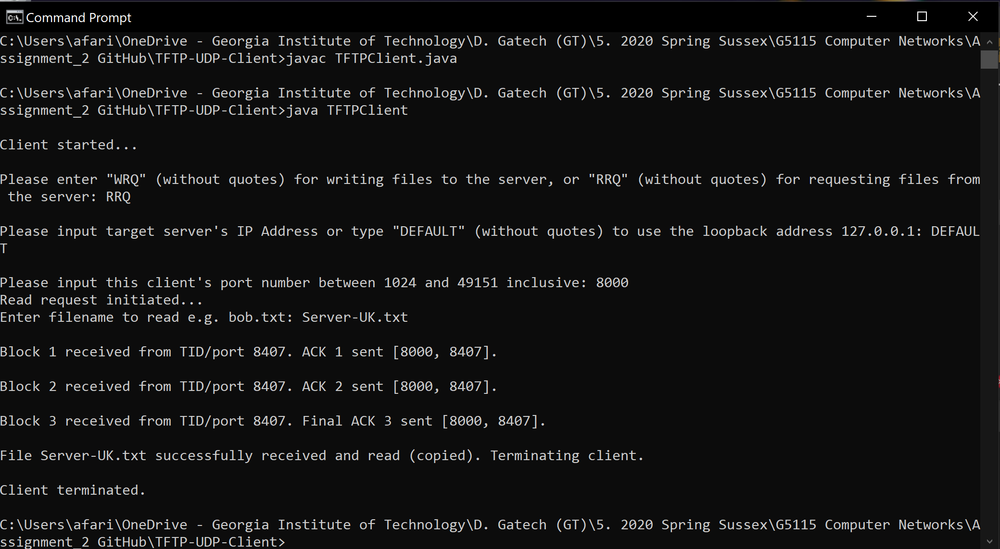
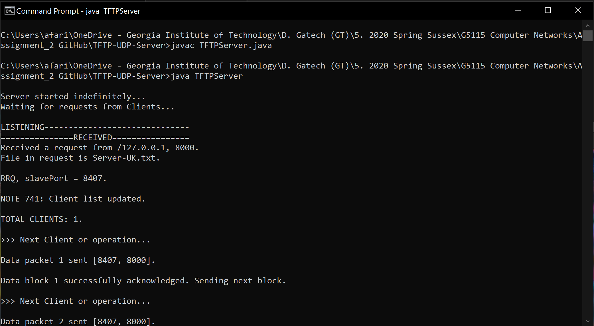
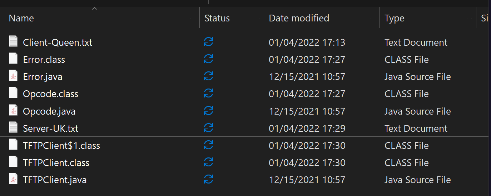
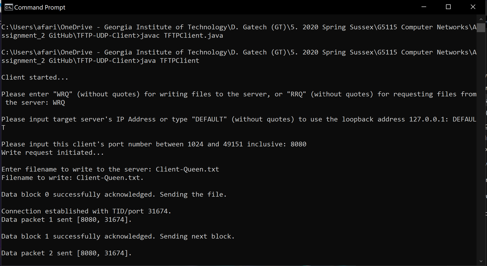
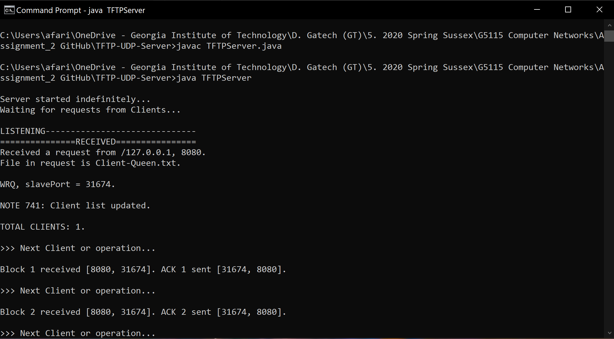
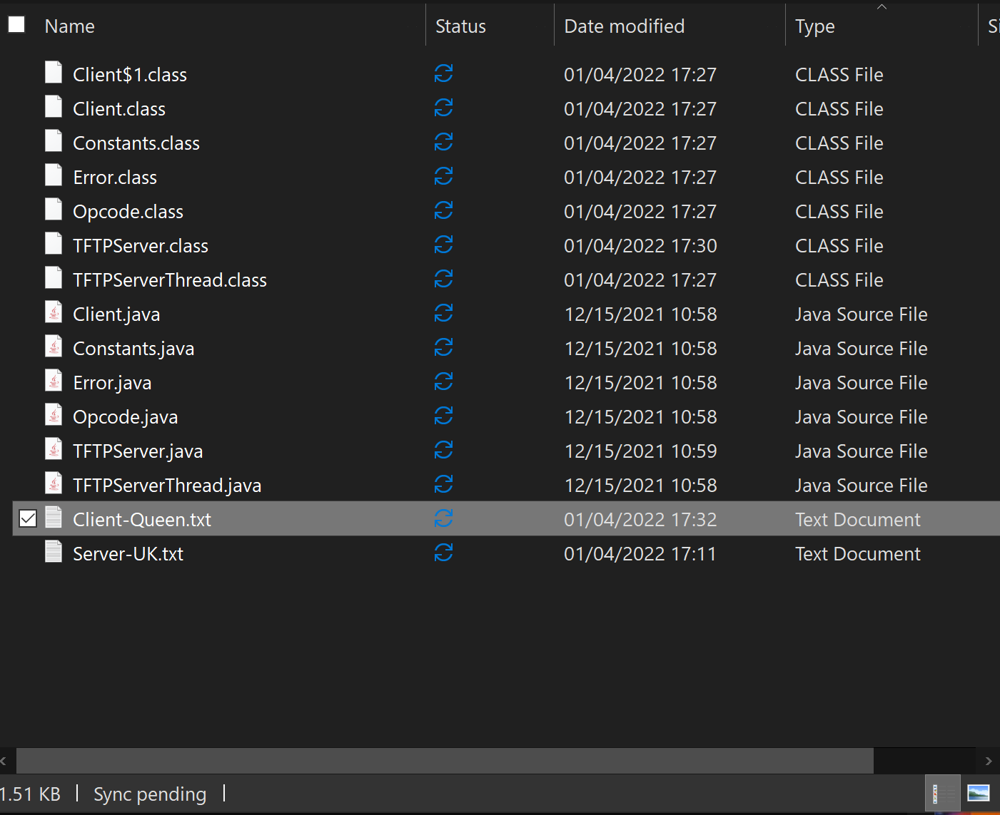

# TFTP Protocol — A Simplified Reimplementation
A reimplementation of a simplified version of the Trivial File Transfer Protocol based on [RFC 1350](https://datatracker.ietf.org/doc/html/rfc1350). A server interacts in real time with multiple clients to send/receive small UDP packets of data and corrects for corruption or losses.

**Author**: [Faris Durrani](https://github.com/farisdurrani/)  
**GitHub source**: [TFTP Protocol](https://github.com/farisdurrani/TFTP-Protocol) 
**Implementation Date**: Apr 23, 2020

## How to Use on Local Machine
1. Open two terminals, one for the server and another for the client.
2. In the first terminal, navigate to the `TFTP-UDP-Client` directory, 
    - Compile the source files using `javac TFTPClient.java`
    - Then, start the client side using `java TFTPClient`
3. In the second terminal, navigate to the `TFTP-UDP-Server` directory, 
    - Compile the source files using `javac TFTPServer.java`
    - Then, start the server side using `java TFTPServer`
4. Back to the client terminal, follow the commands to read from or write to the server.
    - If wanting to read from the server, 
        - Type `RRQ` when prompted. Press `ENTER`. 
        - Then, your IP Address as `DEFAULT`. Press `ENTER`. 
        - Then, type in a random port number which will be your client port number, e.g., `8080`. Press `ENTER`. 
        - Then, type in the name of the target file to read from the server. A sample file `Server-UK.txt` has been given. Note that the file to be read must already exist within the server's directory. Press `ENTER`.
        - The file to be read will be transferred to the client's directory `TFTP-UDP-Client`.
        - The following is what we see on the Terminal (Client side):
        
        - The following is what we see on the Terminal (Server side):
        
        - As a result, we see a new file existing in the client directory `TFTP-UDP-Client`:
        
    - If wanting to write to the server, 
        - Type `WRQ` when prompted. Press `ENTER`. 
        - Then, your IP Address as `DEFAULT`. Press `ENTER`. 
        - Then, type in a random port number which will be your client port number, e.g., `8080`. Press `ENTER`. 
        - Then, type in the name of the target file to write to the server. A sample file `Client-Queen.txt` has been given. Note that the file to be written must already exist within the client's directory. Press `ENTER`.
        - The file to be written will be transferred to the server's directory `TFTP-UDP-Server`.
        - The following is what we see on the Terminal:
        
        - The following is what we see on the Terminal (Server side):
        
        - As a result, we see a new file existing in the server directory `TFTP-UDP-Server`:
        
    - In any case, 

## Corruption Fabrication
In line with the requirements of [RFC 1350](https://datatracker.ietf.org/doc/html/rfc1350), this simple protocol is able to handle some levels of packet corruption using timeouts and acknowledgement packets. While corruption has already been handled automatically by UDP, we can fabricate some levels of corruption using by changing the double variable `LOST_PROBABILITY` in the range of [0.0, 1.0) in `TFTPClient.java` on the client side and in `Constants.java` on the server side.

## Multiple Clients
This protocol can handle multiple clients sending/receiving data from the same server as well. Simply additional terminals to act as the additional clients. The maximum number of clients supported has not been verified.

Obviously, the clients' port numbers must be distinct. 

## Additional information
For additional information including a discussion on the overall protocol, please refer to the [Assignment 2 Report.pdf](Assignment%202%20Report.pdf) file.

## License
 This work is licensed under a <a rel="license" href="http://creativecommons.org/licenses/by/4.0/">Creative Commons Attribution 4.0 International License</a>.
